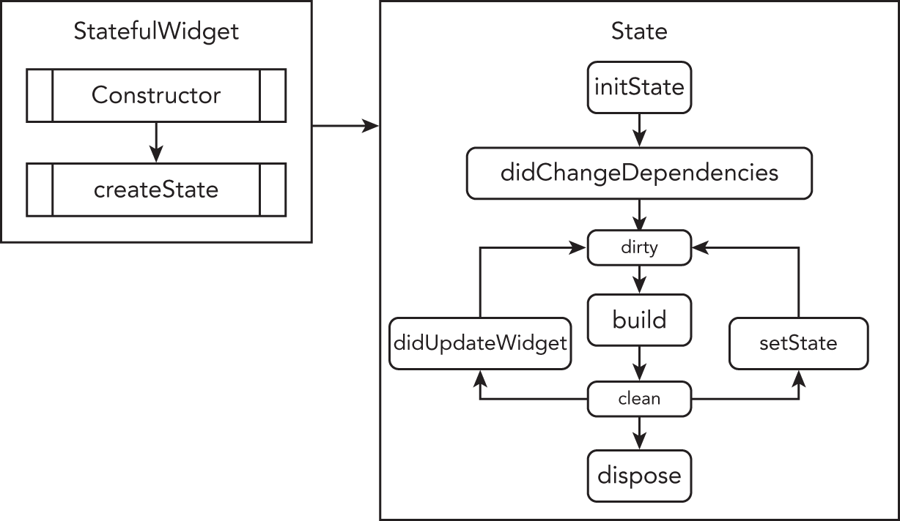

## 폰트설정  
```dart
// pubspec.yaml
  fonts:
  - family: Pretendard
    fonts:
      - asset: assets/fonts/Pretendard-Regular.ttf
        weight: 400
      - asset: assets/fonts/Pretendard-Medium.ttf
        weight: 500
      - asset: assets/fonts/Pretendard-SemiBold.ttf
        weight: 600
      - asset: assets/fonts/Pretendard-Bold.ttf
        weight: 700
        
// main.dart
return MaterialApp(
      home: MyHome(),
      theme: ThemeData(
        fontFamily: 'Pretendard',
        textTheme: TextTheme(
            // bodyText2가 기본 텍스트 스타일로 적용됨
            bodyText2: TextStyle(color: Colors.yellow.shade800),
        ),
      ),
    );
```
## Theme  
    MaterialApp의 Theme속성은 앱의 전체적인 스타일링을 설정할 수 있다  
    Theme.of 메서드는 정적 메서드이다  
    가장 가까운 BuildContext에서 명시되어있는 ThemeData의 값을 찾아서 반환  


```dart
// Custom theme
return MaterialApp(
      home: MyHome(),
      theme: ThemeData(
        fontFamily: 'Pretendard',
        brightness: Brightness.dark,
        highlightColor: Colors.yellow,
        primaryColor: Colors.red,
        accentColor: Colors.purple,
        textTheme: TextTheme(
            // bodyText2가 기본 텍스트 스타일로 적용됨
            bodyText1: TextStyle(color: Colors.teal),
            bodyText2: TextStyle(color: Colors.yellow.shade800),
        ),
      ),
    );

// 특정 theme data 적용방법
Text(
    'Sub Title 1',
    style: Theme.of(context).textTheme.subtitle1,
),


// 예제2
SliderTheme(
  data: SliderTheme.of(context).copyWith(
    inactiveTrackColor: Color(0xFF8D8E98),
    activeTrackColor: Colors.white,
    thumbColor: Color(0xFFEB1555),
    overlayColor: Color(0x29EB1555),
    thumbShape:
        RoundSliderThumbShape(enabledThumbRadius: 15.0),
    overlayShape:
        RoundSliderOverlayShape(overlayRadius: 30.0),
  ),
  child: Slider(
    value: height.toDouble(),
    min: 120.0,
    max: 220.0,
    onChanged: (double newValue) {
      setState(() {
        height = newValue.round();
      });
    },
  ),
),


// Dark theme
return MaterialApp(
      theme: ThemeData.dark(),
      home: LoadingScreen(),
    );


```
- loading screen  
    loading screen위젯에 loding widget을 그려두고, 위젯의 initState생명주기에서 데이터 fetch후 화면이동하는 로직을 넣는다
```dart
 @override
  void initState() {
    super.initState();
    getLocationData();
  }

  void getLocationData() async {
    var weatherData = await WeatherModel().getLocationWeather();

    Navigator.push(context, MaterialPageRoute(builder: (context) {
      return LocationScreen(
        locationWeather: weatherData,
      );
    }));
  }
```
- How to use Dart to perform asynchronous tasks.
```dart
// Future 변수를 통해 미래에 들어오게 될 값을 선언할 수 있다
// .then((res)=> {})를 통해 미래에 들어온 값을 핸들링 할 수 있다
Future<int> future = futureNumber();

future.then((val) {
    // int가 나오면 해당 값을 출력
    print('val: $val');
  }).catchError((error) {
    // error가 해당 에러를 출력
    print('error: $error');
  });
```
- Understand async and await.  
    Future를 좀더 용이하게, 간결하게 다루기 위한 키워드이다
```
1. await 를 만나면 함수를 잠시 멈추고 함수를 호출한 곳에 Future 를 return 한다.
2. await 가 붙은 동작이 완료되기 전까지 함수를 더 이상 진행하지 않는다.
3. return 을 통해 1번에서 주었던 Future 에서 return 값이 나오게 한다.
```
- Learn about Futures and how to work with them.  
    Future는 await함수가 return되기전에는 Future자료형이다. 
    이를 이용해 Future를 렌더링 할 수 있는 FutureBuilder라는 위젯이 있다
- How to network with the Dart http package.
```dart
// NetworkHelper class
class NetworkHelper {
  NetworkHelper(this.url);

  final String url;

  Future getData() async {
    http.Response response = await http.get(url);

    if (response.statusCode == 200) {
      String data = response.body;

      return jsonDecode(data);
    } else {
      print(response.statusCode);
    }
  }
}
```
- What JSONs are and how to parse them using the Dart convert package.
```dart
// import 'dart:convert';
// use jsonDecode
String data = response.body;
return jsonDecode(data);
```
- How to pass data forwards and backwards between screens using the Navigator.
```dart
// MaterialPageRoute를 이요해 이동할 위젯을 설정하고, 생성자를 통해 필요한 데이터를 전달한다
Navigator.push(context, MaterialPageRoute(builder: (context) {
      return LocationScreen(
        locationWeather: weatherData,
      );
    }));
```

- How to handle exceptions in Dart using try/catch/throw.
- How to use the Geolocator package to get live location data for both iOS and - Android.
```dart
// geolocator: ^3.0.1
// example
Future<void> getCurrentLocation() async {
    try {
      Position position = await Geolocator()
          .getCurrentPosition(desiredAccuracy: LocationAccuracy.low);

      latitude = position.latitude;
      longitude = position.longitude;
    } catch (e) {
      print(e);
    }
  }
```
- How to use the TextField Widget to take user input.  
    TextField의 현재값은 onChanged(value)의 인자로 들어오게 된다
- Learn about the lifecycle of Stateful Widgets and how to override them.

1. 
```dart
// 1. createState
// 새로운 Stateful 위젯을 만들 때 호출되며 필수 메서드이다. 연결된 State의 인스턴스를 반환
class Home extends StatefulWidget {
  @override
  HomeState<StatefulWidget> createState() => Home();
}

// 2. initState()
// 위젯이 생성될때 처음으로 호출 메서드. 한번 만 호출 된다. 반드시 super.initState()를 호출해야 한다.
@override
void initState(){
  super.initState();
}

// 3. build()
// 렌더링하는 함수, 상태값이 변경될 때마다 실행된다(매우 자주이기 때문에 로직이나 네트워킹 기능을 넣지 않도록 한다)
@override
Widget build(BuildContext context) {
 //add your widgets
}

// 4. dispose()
// State객체가 영구히 제거 된다
@override
void dispose(){
   super.dispose();
}
```
