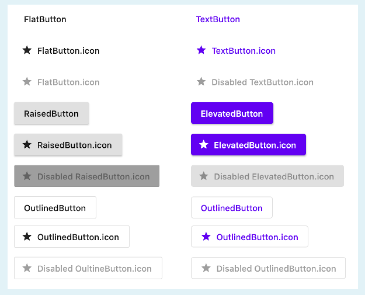

- Buttons  

### Deprecated
~~FlatButton, RaisedButton, OutlineButton~~
### Recommended
TextButton, ElevatedButton, OutlinedButton
```dart
// styling

// ButtonStyle이용
TextButton(
    onPressed: () {},
    style: ButtonStyle(
    textStyle:
    MaterialStateProperty.all(TextStyle(fontSize: 14)),
    foregroundColor:
    MaterialStateProperty.all(Colors.white),
    ),
    child: Text("TextButton"),
),
ElevatedButton(
    onPressed: () {},
    style: ButtonStyle(
        textStyle: MaterialStateProperty.all(
            TextStyle(fontSize: 14, color: Colors.white)),
        backgroundColor:
        MaterialStateProperty.all(Colors.blue)),
    child: Text("ElevatedButton"),
),
OutlinedButton(
    onPressed: () {},
    style: ButtonStyle(
    foregroundColor:
    MaterialStateProperty.all(Colors.white),
    textStyle:
    MaterialStateProperty.all(TextStyle(fontSize: 14)),
    ),
    child: Text("OutlinedButton"),
)

// StyleFrom 이용
ElevatedButton(
    onPressed: () { },
    child: Icon(
    Icons.movie,
    color: Colors.white
    ),
    style: ElevatedButton.styleForm(
        primary: Colors.blue,
        padding: EdgeInsets.symmetric(vertical: 15, horizontal: 50)
    ),
),
```


- How to use Flutter stateful widgets to update the user interface.  
- How to use setState to mark the widget tree as dirty and requiring update on - the next render.  
    State클래스 내부에 변수를 만든 뒤, setState()함수를 통해 변수를 변경시키면 build()메소드가 재실행 되면서 화면이 다시 그려진다  
- How to use onClick listeners to detect when buttons are pressed.  
    버튼 위젯의 속성으로 onPressed() 콜백함수가 있어서 클릭이벤트를 감지할 수 있다.
- How to use expanded to make widgets adapt to screen dimensions.  
    Expanded 위젯은 가능한한 최대의 크기를 가지려 확장된다. 여러개의 Expanded위젯이 쓰일경우 flex속성값을 비율로 넓혀진다
- Understand and use string interpolation.  
```dart
// $키워드를 통해 string에서 변수를 참조할 수 있다. 2depth이상인 경우 {}를 추가한다
$VARIABLE
${VARIABLE.property}
```
- random()
```
int randomNum = Random().nextInt(6) + 1; // 0부터 5까지 범위에서 랜덤한 정수값을 생성후 1을더해 반환한다
```